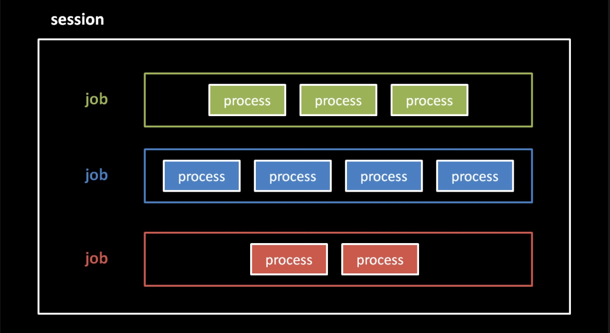

# Built-ins

- Executed in the shell or subshell
- Can be redirected/piped like a process command
  - Built-ins receive a duplicate of `STDIN`, `STDOUT` and `STDERR`

### `help`

- Prints the general usage and lists built-ins
- Can also print built-in-specific help: `help echo`

### `echo`

- https://unix.stackexchange.com/questions/63658/redirecting-the-content-of-a-file-to-the-command-echo
- Writes arguments to `STDOUT`
- `-n` flag doesn’t append a new line

```bash
# Prints "foo 3245\n" to STDOUT
echo foo 3245
# Prints "foo 3245" to STDOUT
echo -n foo 3245
# Prints "foo 3245 -n\n" to STDOUT
echo foo 3245 -n
```

### `cd`

- Set the shell’s current working directory
- Forks and subshells inherit the parent’s working directory

### `pwd`

- Print the shell’s current directory

### `export`

- Marks a shell variable as an environment variable
- Forks and subshells inherit environment variables

```bash
run_in_tandem () {
	echo '========================================='
	echo -n "SUBSHELL: "
	bash -c 'echo $foo baz'
	echo -n "PARENT SHELL: "
	echo $foo baz
}

# Unset foo to reset test
unset foo

# Declare foo and expand it on parent and sub shell
foo=8
run_in_tandem

# Export foo to access it on the subshell
export foo
run_in_tandem

# Changing the value of foo also changes the environment variable
foo=10
run_in_tandem
```

### `unset`

- Uninitializes variable: removes it from local variables and environment variables

```bash
# Initializes buzz
buzz=dsa
echo $buzz
# Exports buzz
export buzz
echo $buzz
# Uninitializes buzz
unset buzz
echo $buzz
```

### `env`

- Prints all environment variables
- Not a built-in in Ubuntu

```bash
# Initialize bozia
unset bozia
bozia=42
env | grep bozia
# Export bozia
export bozia
env | grep bozia
# Uninitialize bozia
unset bozia
env | grep bozia
```

### `exit`

- Exits the shell
- C `exit()`
- Same as `Ctrl+D`

### `jobs`, `bg` and `fg`



- Shell starts as a session with one foreground job in the controlling terminal
- Background jobs receive the `SIGTTIN` when they try to read from the controlling terminal
- `Ctrl+Z` sends `SIGTSTP` to the foreground job and `SIGCONT` to processes of the next job, moving them to the foreground
- `jobs` list background jobs and their job number
- `bg job_number` send `SIGCONT` to a background job
- `fg job_number` send `SIGCONT` to a background job and move it to the foreground

### `source`

- Executes commands from the file in the current shell

```bash
# This is what happens when you create a new shell
source ~/.bashrc
```

### Shebang

- Tells the executor to run the script with the specified interpreter

```bash
#!/bin/bash
#!/bin/python
#!/bin/perl
#!/bin/ruby
```
